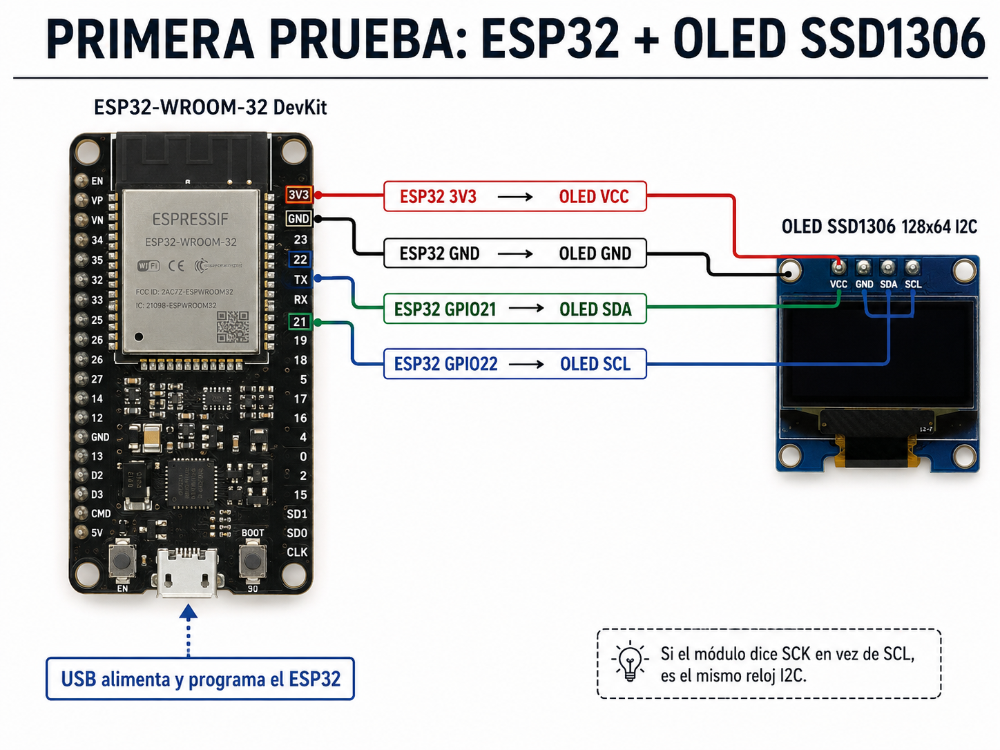
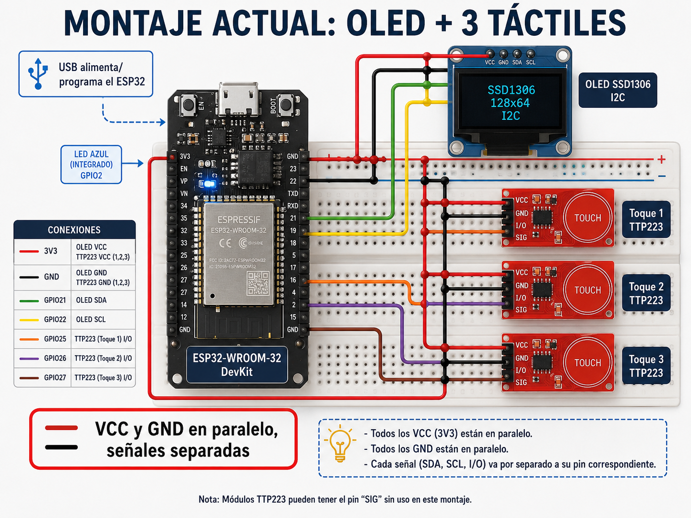
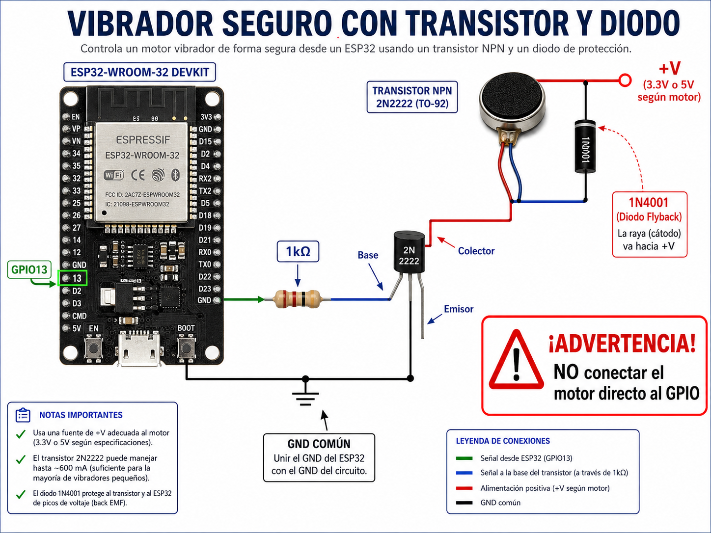

# Diagrama de conexiones / Wiring

Esquemas de cableado del Rapa Mochi sobre **ESP32-WROOM-32 (ESP32 Dev Module)**.

> ⚡ **Para la PRIMERA prueba solo necesitas la OLED.** Todo lo demás (botones, vibrador,
> sonido, batería) es **opcional** y viene desactivado por flags en `config.h`. Puedes
> alimentar el ESP32 por **USB** mientras pruebas.

---

## 0) Mapa de pines usados

```
                      ESP32-WROOM-32 (DevKit)
                     ┌───────────────────────┐
                3V3 ─┤ 3V3               GND ├─ GND
                     │                       │
        OLED SDA ────┤ GPIO21 (SDA)   GPIO22 ├──── OLED SCL
                     │                       │
        Boton 1 ─────┤ GPIO25         GPIO13 ├──── Vibrador (base/gate driver)
        Boton 2 ─────┤ GPIO26         GPIO14 ├──── Buzzer pasivo / sonido
        Boton 3 ─────┤ GPIO27         GPIO34 ├──── Bateria (ADC, divisor)
                     │                       │
        LED azul ────┤ GPIO2 (integrado)     │
                     │             USB / 5V ─┤ alimentacion (prueba)
                     └───────────────────────┘
```

| Señal | Pin | Notas |
|-------|-----|-------|
| OLED SDA | GPIO21 | I2C |
| OLED SCL | GPIO22 | I2C |
| LED estado | GPIO2 | integrado en la placa |
| Botón 1/2/3 | GPIO25/26/27 | `INPUT_PULLUP` |
| Vibrador | GPIO13 | vía transistor/MOSFET |
| Sonido | GPIO14 | buzzer pasivo / amplificador |
| Batería (medir) | GPIO34 | ADC1, sólo entrada |

---

## 1) OLED SSD1306 128×64 I2C  ✅ (necesaria para la primera prueba)



```
   ESP32                         OLED SSD1306 (I2C, dir 0x3C)
   ┌──────┐                      ┌──────────────────┐
   │  3V3 ├──────────────────────┤ VCC              │
   │  GND ├──────────────────────┤ GND              │
   │ G21  ├──────────────────────┤ SDA              │
   │ G22  ├──────────────────────┤ SCL              │
   └──────┘                      └──────────────────┘
```

Eso es todo lo necesario para ver las caras del Mochi. Si tu módulo trae el pin como
**SCK** en vez de SCL, es el mismo (reloj I2C).

---

## Montaje actual (OLED + 3 táctiles)  📋



Plano de **lo que tienes conectado ahora**, alimentando por **USB**. Fíjate que **3V3** y
**GND** son rieles **compartidos** (la OLED y los 3 sensores cuelgan de los mismos dos pines):

```
        ┌──────────────── ESP32-WROOM-32 (DevKit) ────────────────┐
  USB ──┤ (alimentacion / programacion)                           │
        │                                                          │
        │  3V3 ──┬── OLED VCC                                      │
        │        ├── TTP223(1) VCC ── TTP223(2) VCC ── TTP223(3) VCC   (riel +3V3)
        │        │                                                 │
        │  GND ──┬── OLED GND                                      │
        │        ├── TTP223(1) GND ── TTP223(2) GND ── TTP223(3) GND   (riel GND)
        │        │                                                 │
        │  G21 ───── OLED SDA                                      │
        │  G22 ───── OLED SCL                                      │
        │                                                          │
        │  G25 ───── TTP223(1) I/O   (toque 1)                     │
        │  G26 ───── TTP223(2) I/O   (toque 2)                     │
        │  G27 ───── TTP223(3) I/O   (toque 3)                     │
        │                                                          │
        │  G2  ───── LED azul (integrado en la placa)             │
        └──────────────────────────────────────────────────────────┘
```

> 💡 "Riel compartido" = puedes llevar un solo cable de **3V3** a una fila de la protoboard
> y de ahí repartir a OLED + 3 sensores; igual con **GND**. Las **señales** (SDA, SCL y los
> 3 I/O) sí van **cada una a su pin**.

---

## 2) Sensores táctiles TTP223 (×3)  — `INPUT_ENABLED 1` (ya activado)

Sensores **capacitivos TTP223** (los rojos que dicen `TOUCH`). Cada uno tiene 3 pines:
**VCC**, **GND** e **I/O** (salida). Al tocar el círculo, la salida se pone en **ALTO**.

### Cómo conectarlos: alimentación en PARALELO, señales SEPARADAS (no en serie)

- **VCC**: los 3 VCC van **juntos** al **3V3** del ESP32 (mismo riel).
- **GND**: los 3 GND van **juntos** al **GND** del ESP32 (mismo riel).
- **I/O**: cada salida va a **su propio GPIO** (25, 26, 27) — así se distinguen los 3 toques.

```
   ESP32 3V3 ──┬─────────┬─────────┬──────   (VCC de los 3, en paralelo)
               │         │         │
              VCC       VCC       VCC
           ┌────────┐┌────────┐┌────────┐
           │ TTP223 ││ TTP223 ││ TTP223 │
           │  (1)   ││  (2)   ││  (3)   │
           └────────┘└────────┘└────────┘
              GND       GND       GND
               │         │         │
   ESP32 GND ──┴─────────┴─────────┴──────   (GND de los 3, en paralelo)

              I/O       I/O       I/O
               │         │         │
             GPIO25    GPIO26    GPIO27        (una señal por pin)
```

| TTP223 | ESP32 |
|--------|-------|
| VCC (los 3) | **3V3** |
| GND (los 3) | **GND** |
| I/O sensor 1 | **GPIO25** |
| I/O sensor 2 | **GPIO26** |
| I/O sensor 3 | **GPIO27** |

### Configuración en `config.h`

```cpp
#define BUTTON_USE_PULLUP   0   // TTP223: el sensor maneja la linea
#define BUTTON_ACTIVE_HIGH  1   // TTP223: tocar = ALTO
```

> El firmware usa `INPUT_PULLDOWN` en esos pines: si un sensor no está conectado, el pin
> queda en BAJO y **no** dispara toques falsos. Cada toque ejecuta la acción que le
> asignes a ese "botón" en el panel web.
>
> Pads **A/B** del TTP223 (opcional): **A** = modo *toggle*; **B** = invierte a activo en
> BAJO (entonces usa `BUTTON_ACTIVE_HIGH 0`). Por defecto (sin soldar) = toque momentáneo
> activo en ALTO, que es lo que espera la config de arriba.

---

## 3) Vibrador  — opcional (`VIBRATION_ENABLED 1`)



⚠️ El motor **nunca** va directo al GPIO. Usa un **transistor NPN** (p. ej. 2N2222) o un
**MOSFET de nivel lógico** (p. ej. 2N7000 / IRLZ44N) y un **diodo flyback** (1N4001) en
paralelo al motor.

```
                         +V  (3V3 o 5V según el motor)
                          │
                     ┌────┴────┐
                     │  MOTOR  │
                     └────┬────┘
                          ├───────────────┐
                       ▲  │ (diodo 1N4001 │  cátodo = raya hacia +V)
                       │  │  en paralelo  │
                          ▼               │
                          │  Colector     │
   G13 ──[ 1kΩ ]──── Base │   NPN 2N2222  │
                          │  Emisor       │
                          └───────────────┴──── GND
```

- **Transistor**: Base ← (1 kΩ) ← GPIO13 · Colector → motor → +V · Emisor → GND.
- **MOSFET**: Gate ← (100 Ω) ← GPIO13 (+ 100 kΩ Gate→GND) · Drain → motor · Source → GND.
- **Diodo flyback** en paralelo al motor, cátodo (raya) hacia +V. Protege contra picos.

---

## 4) Sonido  — opcional (`SOUND_ENABLED 1`)

**Opción simple — buzzer pasivo** directo (poco volumen):

```
   G14 ──────────[ BUZZER PASIVO ]────────── GND
```

**Opción con amplificador** (parlante real 4–8 Ω): usa **PAM8403** o **MAX98357A (I2S)**
con su propia alimentación estable. El GPIO solo no mueve un parlante.

---

## 5) Batería 18650  — opcional (`BATTERY_ENABLED 1`)

⚠️ Nunca cargues litio sin protección. Usa un **TP4056 con protección** (DW01 + FS8205).

```
   18650 (+) ──── B+ ┌──────────┐ OUT+ ───┬────────────► alimentación regulada
                     │  TP4056  │         │   (boost a 5V → VIN, o LDO a 3V3;
   18650 (-) ──── B- │ (protec.)│ OUT- ───┼──┐   NO conectes la celda al 3V3)
                     └──────────┘         │  │
   carga: USB del TP4056                  │ GND (común con ESP32)
                                          │
   medición de carga (divisor 2×100k):    │
        OUT+ ──[100kΩ]──┬──[100kΩ]── GND  │
                        │                 │
                      G34 (ADC) ──────────┘
```

- **Alimentación**: la celda da ~3.7–4.2 V. **No** la conectes directo a `3V3`. Usa un
  **boost a 5 V → VIN/5V** del DevKit, o un **regulador 3.3 V** adecuado.
- **Medición**: divisor **2×100 kΩ** de OUT+ a GND, punto medio a **GPIO34**. El firmware
  usa `BATTERY_DIVIDER 2.0` (ajústalo si usas otras resistencias).
- **GND común** entre batería, regulador y ESP32.

---

## Resumen rápido

| Quieres probar… | Necesitas cablear | Flag en `config.h` |
|-----------------|-------------------|--------------------|
| Las caras / panel web / WiFi | **Solo la OLED** | (nada que tocar) |
| Botones | OLED + botones a GND | `INPUT_ENABLED 1` (ya) |
| Vibrador | + transistor/MOSFET + diodo | `VIBRATION_ENABLED 1` |
| Sonido | + buzzer/amplificador | `SOUND_ENABLED 1` |
| Batería | + TP4056 + divisor | `BATTERY_ENABLED 1` |

Detalles de componentes y seguridad en [`hardware.md`](hardware.md).
